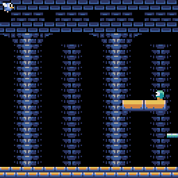
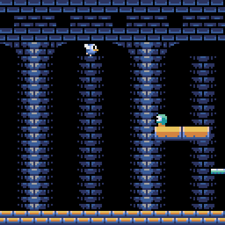
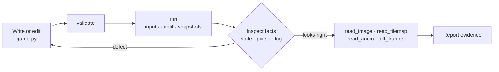

# pyxel-mcp

**Let AI agents play, watch, and measure [Pyxel](https://github.com/kitao/pyxel) games.** pyxel-mcp is an MCP server that runs a Pyxel script headlessly, feeds it scheduled input, stops when a condition holds, and hands back the facts: screenshots, pixel grids, game state, assets, audio, and frame diffs.

[](https://pypi.org/project/pyxel-mcp/)
[](https://pypi.org/project/pyxel-mcp/)
[](https://github.com/kitao/pyxel-mcp/actions/workflows/test.yml)
[](LICENSE)
[](https://registry.modelcontextprotocol.io)

<p align="center">
  
  
</p>
<p align="center"><sub>Both images come from one <code>run</code> call against Pyxel's bundled <code>10_platformer.py</code>: 150 frames, right held from frame 0, jumps scheduled at frames 25, 70, and 110, a <code>video</code> snapshot, and an inline <code>screen_image</code> snapshot.</sub></p>

## Why

An agent can write a Pyxel game in seconds, but it cannot open a window, press the arrow keys, or look at the screen. Editor-bound engines solve this with MCP servers that live inside the editor. Pyxel has no editor process to attach to, so pyxel-mcp drives the game itself:

- **Headless and deterministic.** Every call runs the script in a fresh subprocess with SDL dummy drivers, an optional RNG seed, and a frame budget. The same call gives the same frames on a laptop or in CI.
- **Input as data.** Buttons, axes, and mouse position are scheduled per frame, so a playtest is a JSON document the agent can rerun and extend.
- **Stop on the event, not the clock.** `until="score >= 1"` ends the run at the first frame where a game attribute holds, and `"frame": "end"` snapshots capture that moment.
- **Facts, not scores.** Tools report pixels, values, and measurements. Deciding whether the game is good stays with the agent and the person asking for it.
- **See the frame in the result.** `inline: true` returns a PNG as MCP image content, so the model looks at the screen without a second file read.

## Install

Register the stdio server with your client:

```bash
claude mcp add --scope user pyxel -- uvx pyxel-mcp
```

```bash
codex mcp add pyxel -- uvx pyxel-mcp
```

```bash
gemini mcp add pyxel uvx pyxel-mcp
```

For Cursor (`~/.cursor/mcp.json`), a project-scoped Claude Code `.mcp.json`, or any other client that reads the common JSON format, add:

```json
   {
     "mcpServers": {
       "pyxel": {
         "command": "uvx",
         "args": ["pyxel-mcp"]
       }
     }
   }
```

VS Code uses `.vscode/mcp.json` with a top-level `servers` key and `"type": "stdio"`; Codex CLI can also be configured in `~/.codex/config.toml` as `[mcp_servers.pyxel]`. Run `uvx pyxel-mcp install` to print every variant.

Claude Code users can instead install the [pyxel-skill](https://github.com/kitao/pyxel-skill) plugin, which registers this server together with the skill that teaches agents how to use it:

```bash
claude plugin marketplace add kitao/pyxel-skill && claude plugin install pyxel@pyxel-skill
```

Restart the client after changing its configuration. The server writes this diagnostic to stderr:

```text
[pyxel-mcp] starting - 8 tools
```

Python 3.11+ is required, and Pyxel >= 2.9.6 is installed as a dependency. Script tools execute local Python in subprocesses to isolate Pyxel state, but they do not sandbox untrusted code. See [SECURITY.md](SECURITY.md).

## How an agent uses it



The loop is deliberately small. The separate [pyxel-skill](https://github.com/kitao/pyxel-skill) project teaches agents when to use each tool and what counts as enough evidence; this package only supplies the observations.

## Tools

Every `script` argument is a file path, not Python source. Relative asset paths inside the script resolve from the script's directory, exactly as under `python game.py`.

| Tool | Returns |
|---|---|
| `validate` | Syntax errors and recognizable Pyxel code patterns, without executing. |
| `run` | Headless frames, scheduled input, logs, and `state`, `screen_image`, `screen_grid`, or `video` snapshots. |
| `pyxel_info` | Installed versions, paths, bundled examples, and resource URIs. |
| `read_palette` | Palette colors and image-bank indices in use. |
| `read_image` | Image-bank pixels and an optional PNG render. |
| `read_tilemap` | Tile coordinates, source bank, usage counts, bounds, and an optional render. |
| `read_audio` | A rendered sound or music WAV plus measurable audio data. |
| `diff_frames` | Pixel differences between two PNG files. |

All tools declare input and output schemas. Every result includes `ok` and `errors`.

Captured PNGs can travel inside the result: set `inline: true` on a `screen_image` snapshot, or `inline=true` on `read_image` and `read_tilemap`, and the PNG is returned as MCP image content next to the structured data. A single inline frame may omit its output path; the file is then written under the system temp directory and its path is still reported, so `diff_frames` and later comparisons keep working. At most 12 images are embedded per call.

## Example

Hold right, jump at frame 25, stop as soon as the score changes, and look at that frame:

```json
{
  "script": "/absolute/path/game.py",
  "frames": 600,
  "random_seed": 7,
  "inputs": [
    {"frame": 0, "buttons": ["KEY_RIGHT"]},
    {"frame": 25, "buttons": ["KEY_RIGHT", "KEY_SPACE"]},
    {"frame": 26, "buttons": ["KEY_RIGHT"]}
  ],
  "until": "score >= 1",
  "snapshots": [
    {"kind": "state", "frame": "end", "attrs": ["score", "player.x"]},
    {"kind": "screen_image", "frame": "end", "scale": 3, "inline": true}
  ]
}
```

The result reports `until_met`, the reached `frame_count`, the requested state values, the PNG path, and the PNG itself as image content. Artifact paths you choose must be absolute. Read `log` even when `ok` is true, and inspect captured images directly when appearance matters.

## Resources

- `pyxel://run-snapshots-schema` — complete `run.snapshots` grammar, including `"end"`, ranges, and `inline`.
- `pyxel://validation-patterns` — categories reported by `validate`.
- `pyxel://palette/default` — default palette table.
- `pyxel://examples/{name}` — source for an example bundled with the installed Pyxel package; discover names with `pyxel_info`.

## Update

`uvx` caches packages. Force a refresh with:

```bash
uvx --refresh-package pyxel-mcp pyxel-mcp install
```

## Troubleshooting

- If tools do not appear, look for the `starting - 8 tools` diagnostic and restart the client.
- If `run` fails, inspect `errors`, `exit_status`, and `log`.
- If a script cannot find an asset, check the path relative to the script file, not to the client's working directory.
- If a validation category is unfamiliar, read `pyxel://validation-patterns`.

## Related

- [Pyxel](https://github.com/kitao/pyxel) — the retro game engine this server observes.
- [pyxel-skill](https://github.com/kitao/pyxel-skill) — the Agent Skill that turns these tools into a build-and-verify workflow.
- [CHANGELOG.md](CHANGELOG.md) — what changed in each release.

## MCP Registry

`mcp-name: io.github.kitao/pyxel-mcp`

## License

MIT — see [LICENSE](LICENSE).
